# Deploying a Scalable Web Application with AWS Elastic Beanstalk

**GBG Internship · Task 2 — Part 1**

This project demonstrates how to deploy a containerized web application on AWS using **Amazon ECR** and **AWS Elastic Beanstalk**. Elastic Beanstalk manages the application environment, while an **Application Load Balancer (ALB)** distributes incoming requests and **Auto Scaling** adjusts the number of EC2 instances within configured limits.

> **Implementation note:** The assignment scenario suggests packaging a Node.js, Flask, or PHP application. The deployment documented here follows the project’s actual setup: a Java application packaged as a Docker image, stored in Amazon ECR, and referenced by `Dockerrun.aws.json`.

---

## Table of Contents

- [Project Overview](#project-overview)
- [Architecture](#architecture)
- [Deployment Configuration](#deployment-configuration)
- [Deployment Walkthrough](#deployment-walkthrough)
- [Verification and Testing](#verification-and-testing)
- [Troubleshooting](#troubleshooting)
- [Security and Operational Notes](#security-and-operational-notes)
- [Repository Contents](#repository-contents)

## Project Overview

Elastic Beanstalk provides a managed way to deploy and operate web applications without manually coordinating every infrastructure component. For this project, the application runs in a Docker container. Its image is stored in **Amazon Elastic Container Registry (ECR)**, and the Elastic Beanstalk Docker platform uses the repository details in `Dockerrun.aws.json` to pull and run that image.

The environment is configured as a load-balanced web server environment. The ALB routes requests to healthy EC2 instances, and the Auto Scaling group maintains the configured capacity and responds to CPU utilization thresholds.

### Project goals

- Publish a container image to Amazon ECR.
- Deploy the image through an Elastic Beanstalk Docker environment.
- Configure an internet-facing Application Load Balancer.
- Scale EC2 capacity between a minimum and maximum instance count.
- Verify application availability and environment health.

## Architecture

```text
Browser
   |
   v
Elastic Beanstalk environment URL
   |
   v
Application Load Balancer (HTTP :80)
   |
   +-------------------------+
   |                         |
   v                         v
EC2 instance              EC2 instance
Docker container          Docker container
   |                         |
   +------------+------------+
                |
                v
       Amazon ECR image
```

Elastic Beanstalk coordinates the environment and its supporting AWS resources. The EC2 instance profile grants instances permission to pull the private container image from ECR.

## Deployment Configuration

The values below are taken from the project screenshots and configuration file. AWS-generated resource names and environment settings may differ when the deployment is recreated.

| Setting | Value shown in this project |
|---|---|
| Elastic Beanstalk application | `GBG-Java-app-team-a` |
| Environment | `GBG-Java-app-team-a-env` |
| Environment tier | Web server |
| Platform | Docker running on 64-bit Amazon Linux 2023 |
| Platform version shown | `4.13.9` |
| ECR repository | `gbg-java-app-team-a` |
| Image tag shown | `latest` |
| Container port | `8090` |
| Host port | `80` |
| Load balancer | Public Application Load Balancer |
| Minimum / maximum instances | `2` / `4` |
| Instance type shown | `t3.small` |
| Scaling metric | Average `CPUUtilization` |
| Scale-out / scale-in thresholds shown | `50%` / `20%` |
| Environment health shown | `Ok` |

## Deployment Walkthrough

### Step 1 — Build the application image

The website shown in the deployment screenshot is **Al-Huda**, an Islamic library application. The application source and its Dockerfile are not included in this project folder; this repository contains the Elastic Beanstalk deployment configuration and screenshots.

In the AWS Console, open **Amazon ECR → Private registry → Repositories**. Create a private repository named `gbg-java-app-team-a` if it does not already exist. Open the repository and choose **View push commands** to get the commands for your AWS account and selected region.

Docker images are built and pushed with Docker and the AWS CLI; the ECR Console provides the repository and the account-specific push instructions, but does not build an image from application source. From the directory containing the application Dockerfile, run the generated commands. They follow this pattern:

```bash
aws ecr get-login-password --region <ECR_REGION> | docker login --username AWS --password-stdin <ACCOUNT_ID>.dkr.ecr.<ECR_REGION>.amazonaws.com

docker build -t gbg-java-app-team-a:<IMAGE_TAG> .
docker tag gbg-java-app-team-a:<IMAGE_TAG> <ACCOUNT_ID>.dkr.ecr.<ECR_REGION>.amazonaws.com/gbg-java-app-team-a:<IMAGE_TAG>
docker push <ACCOUNT_ID>.dkr.ecr.<ECR_REGION>.amazonaws.com/gbg-java-app-team-a:<IMAGE_TAG>
```

Replace the placeholders with your account, region, and release tag. Use an immutable tag, such as a version number or commit SHA, for repeatable deployments. The captured deployment uses `latest`. After pushing, confirm that the tag appears on the repository’s **Images** tab and copy the full image URI for the next step.

```text
<ACCOUNT_ID>.dkr.ecr.<ECR_REGION>.amazonaws.com/gbg-java-app-team-a:<IMAGE_TAG>
```

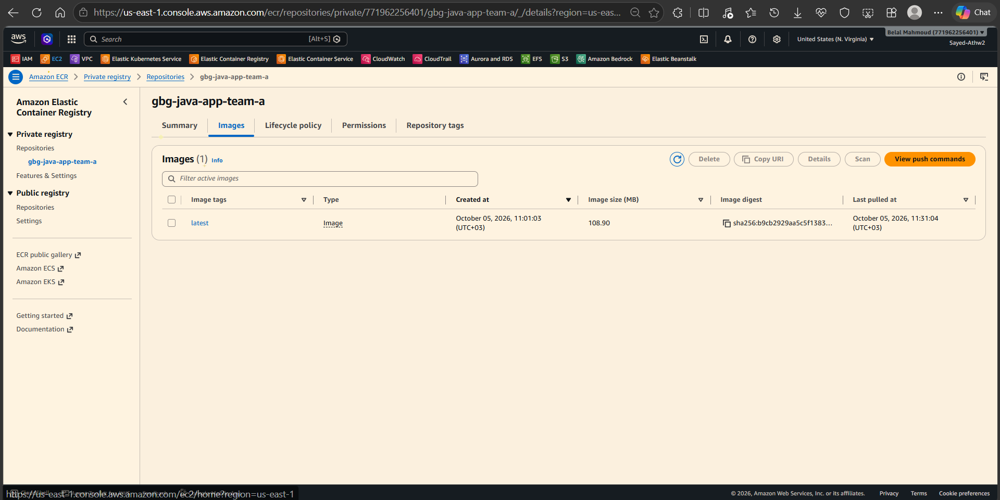

### Step 2 — Grant EC2 permission to pull from ECR

The EC2 instances in the Elastic Beanstalk environment need permission to retrieve the private image.

1. In the AWS Console, open **IAM → Roles**.
2. Create or open the IAM role used by the environment’s EC2 instances.
3. Make sure the role is trusted by the **EC2** service.
4. Attach the required Elastic Beanstalk instance permissions and read access to ECR. The screenshot shows `AWSElasticBeanstalkWebTier` and `AmazonEC2ContainerRegistryReadOnly`.
5. In Elastic Beanstalk’s **Service access** settings, select the role’s EC2 instance profile.

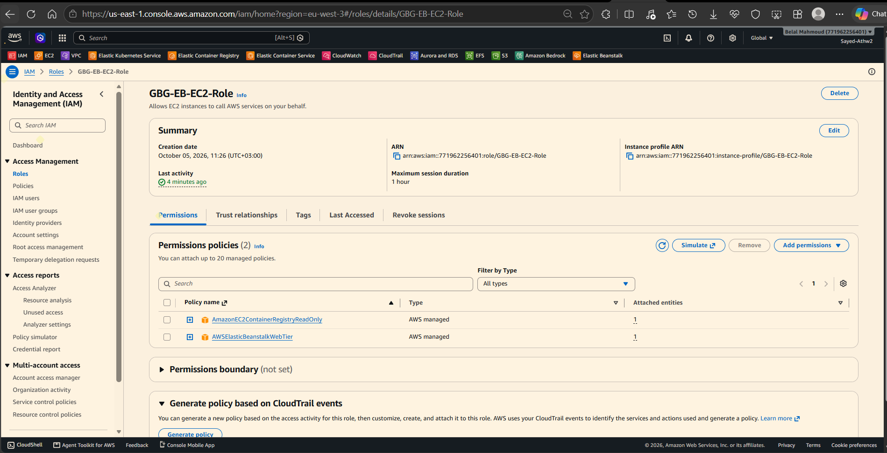

Use IAM roles instead of storing AWS access keys in the image, application files, or repository.

### Step 3 — Configure `Dockerrun.aws.json`

The [Dockerrun.aws.json](./Dockerrun.aws.json) file tells the Elastic Beanstalk Docker platform which image to run and how to map its port. The current file specifies:

- Image: `gbg-java-app-team-a:latest`
- Container port: `8090`
- Host port: `80`
- `Update: true`, so the platform checks for an updated image during deployment

The account and ECR region in the checked-in file are specific to the captured deployment. Replace them with the correct values before deploying from another account or region.

For a single-container Docker environment, package `Dockerrun.aws.json` in a ZIP archive with the file at the **archive root**. Do not place it inside an extra top-level directory.

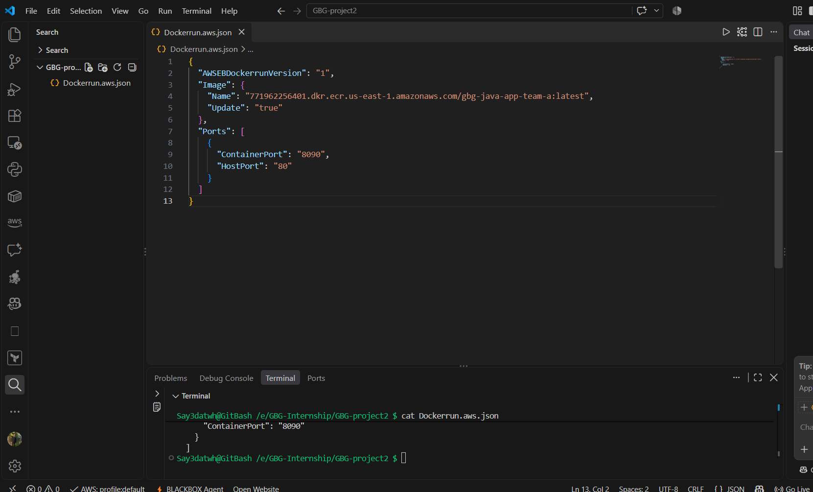

### Step 4 — Create the Elastic Beanstalk application

1. Open **AWS Console → Elastic Beanstalk**.
2. Choose **Applications → Create application**.
3. Enter the application name, for example `GBG-Java-app-team-a`.
4. Create the application. The application is the logical parent for its versions and environments.

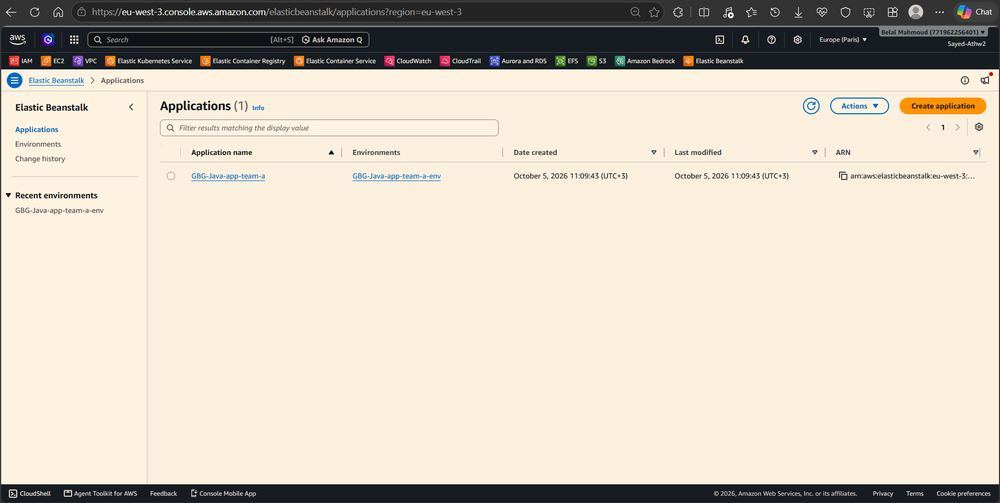

### Step 5 — Create a Docker web server environment

1. Open the application and choose **Create environment**.
2. Select **Web server environment**.
3. Enter an environment name, for example `GBG-Java-app-team-a-env`.
4. Select **Docker running on 64-bit Amazon Linux 2023** (or a currently supported equivalent platform).
5. Upload the ZIP containing `Dockerrun.aws.json` as the application code. Alternatively, create the environment first and deploy the application version from its environment page.
6. Under **Service access**, select the Elastic Beanstalk service role and the EC2 instance profile that can read the ECR image.

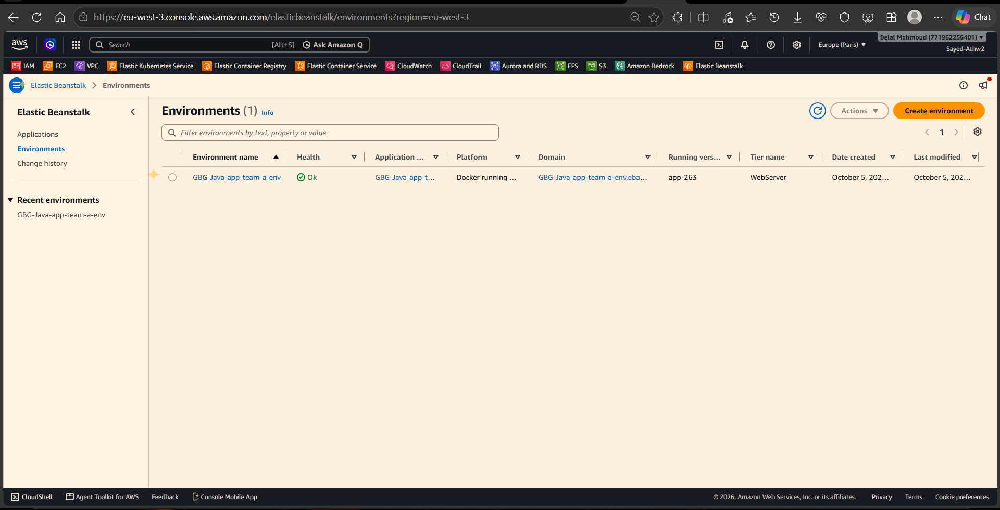

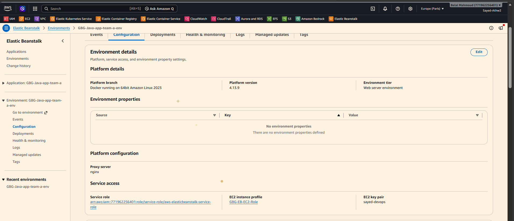

### Step 6 — Configure capacity, networking, and the load balancer

In the environment creation wizard, or later under **Environment → Configuration**, review the **Instances**, **Capacity**, **Networking**, and **Load balancer** settings.

1. Select the VPC and subnets for the environment. For a public ALB, choose load-balancer subnets that provide the intended internet access.
2. Select the EC2 instance type. The project screenshot shows `t3.small`.
3. Choose a **Load balanced** environment and an **Application Load Balancer**.
4. Configure the ALB listener to accept HTTP traffic on port `80`.
5. Confirm that the container listens on port `8090` and that the `Dockerrun.aws.json` mapping is `HostPort: 80` to `ContainerPort: 8090`.
6. Review security groups so that traffic can reach the ALB and the ALB can reach the application instances on the required port.

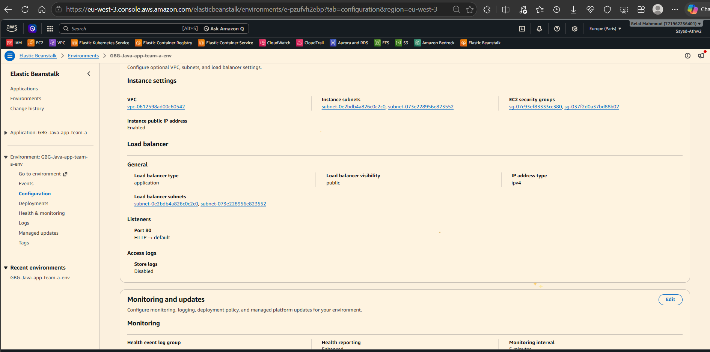

### Step 7 — Configure Auto Scaling

Open **Environment → Configuration → Instances → Edit → Capacity** (the exact console labels may vary by platform version). The project screenshots show these scaling values:

| Auto Scaling setting | Value shown |
|---|---:|
| Minimum instances | `2` |
| Maximum instances | `4` |
| Metric | `CPUUtilization` |
| Statistic | `Average` |
| Scale-out threshold | `50%` |
| Scale-in threshold | `20%` |
| Scale-out increment | `1` |
| Scale-in increment | `-1` |
| Cooldown | `360` seconds |

Review the changes and choose **Apply**. Wait for the environment update to complete before deploying or testing again.

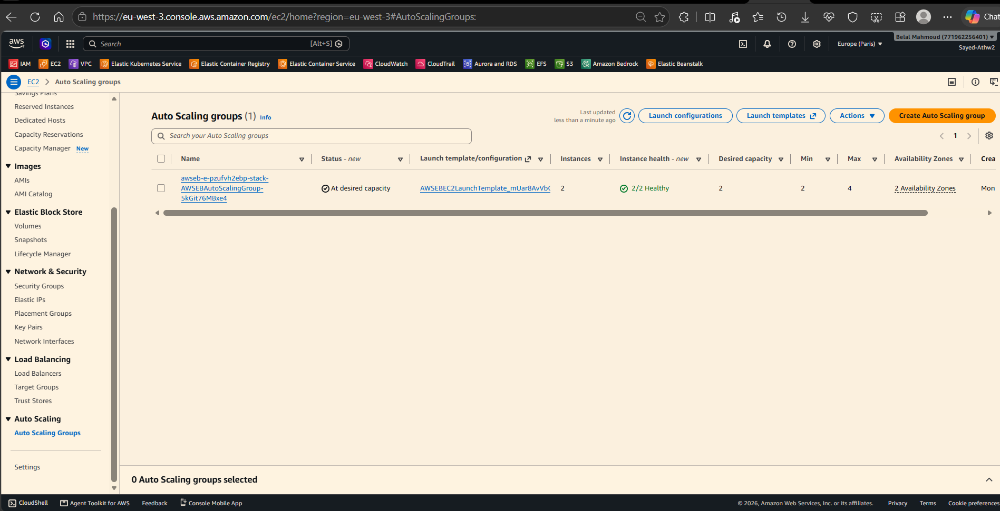

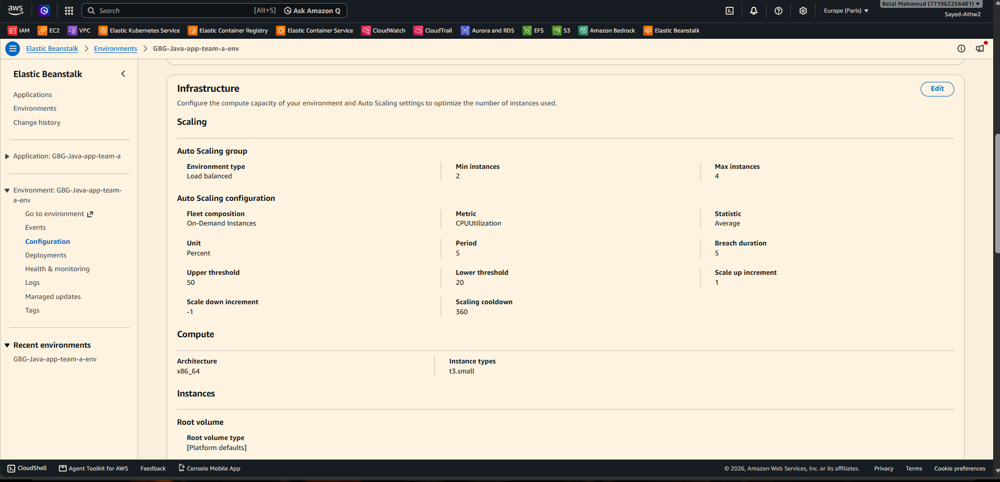

### Step 8 — Wait for deployment and check AWS resources

Environment creation and application deployment take several minutes. In the Elastic Beanstalk environment page:

1. Open **Events** and check for successful environment and application updates.
2. Wait until the environment health reports **Ok**.
3. Open **EC2 → Instances** and confirm that the expected instances are running and their status checks pass.
4. Open **EC2 → Load Balancers** and confirm that the ALB is active.
5. Open the ALB’s target group and confirm that registered targets are healthy.

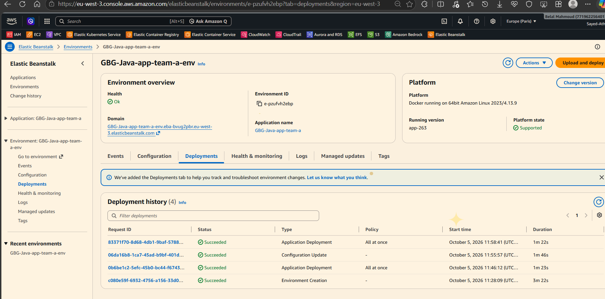

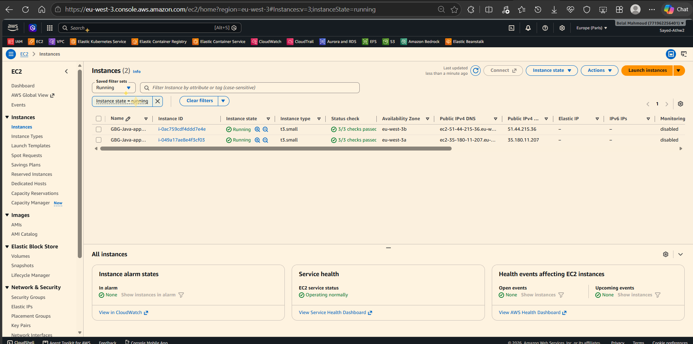

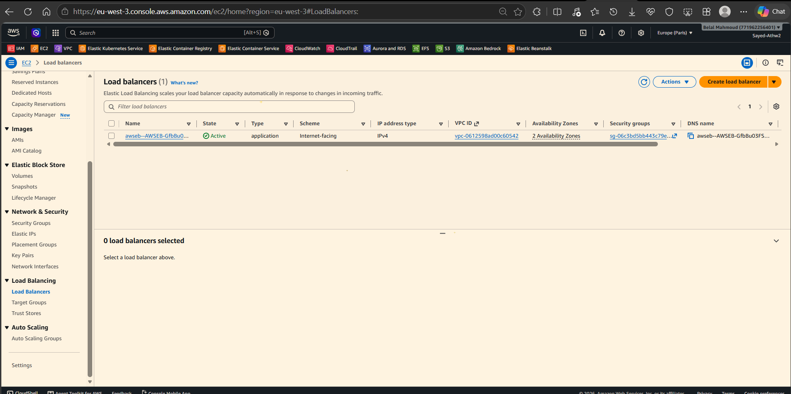

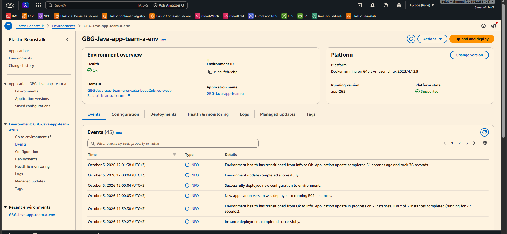

## Verification and Testing

1. In the Elastic Beanstalk environment page, choose **Go to environment** or open the environment’s **Domain** link.
2. Confirm that the website loads and responds.
3. Exercise the application’s main pages and basic functions.
4. Check **Health & monitoring** and **Events** in Elastic Beanstalk.
5. Confirm that the ALB target group reports healthy targets.

The screenshot below shows the deployed Al-Huda website opened through the environment URL:

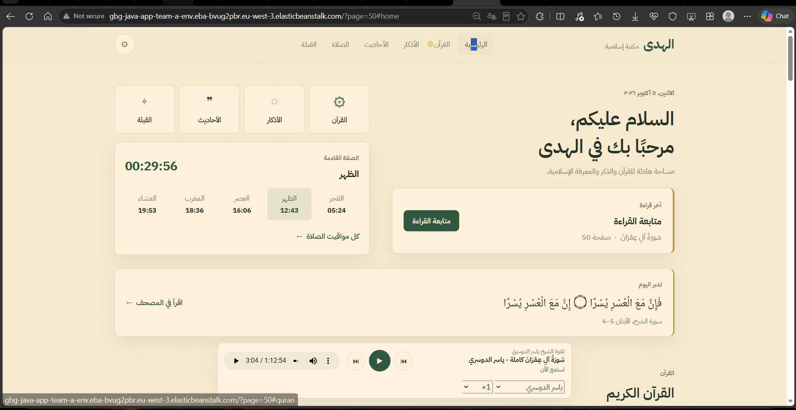

## Troubleshooting

| Symptom | Checks |
|---|---|
| The instance cannot pull the image | Verify the ECR image URI, repository, tag, region, repository permissions, and EC2 instance profile. |
| Environment health does not become `Ok` | Review Elastic Beanstalk **Events** and **Logs**; check the container startup output and instance health. |
| Environment is healthy but the website is unavailable | Confirm the application listens on container port `8090` and the Docker port mapping is correct. |
| ALB returns an error or has no healthy targets | Check the listener, target group health-check path and port, security groups, and application readiness. |
| Auto Scaling does not add instances | Review minimum/maximum capacity, CPU thresholds, cooldown, and whether the metric has crossed its threshold for the configured evaluation period. |
| Application version upload fails | Confirm the ZIP contains a valid `Dockerrun.aws.json` at its root and that the image URI is valid. |

## Security and Operational Notes

- **Region mismatch in the captured setup:** The Elastic Beanstalk environment screenshots show `eu-west-3`, while the ECR image URI in `Dockerrun.aws.json` points to `us-east-1`. Review this before reproducing the deployment. Using the same region for ECR and Elastic Beanstalk is generally simpler. If cross-region image pulls are intentional, verify the repository access policy, IAM permissions, and network access.
- **Account-specific configuration:** The checked-in `Dockerrun.aws.json` contains an AWS account ID in the image URI. Treat it as environment-specific configuration and replace it when deploying elsewhere. An account ID is not an access key, but avoid publishing infrastructure details unnecessarily.
- **Least privilege:** Grant the EC2 role only the permissions needed to pull the required ECR image and operate the environment. Never commit access keys or other secrets.
- **Image versioning:** Prefer unique, immutable image tags for release tracking and rollback. Do not rely on `latest` as the only production version identifier.
- **HTTPS:** The captured environment uses HTTP. For a production deployment, configure an HTTPS listener and certificate using AWS Certificate Manager, and consider redirecting HTTP to HTTPS.
- **Costs:** The configured minimum of two instances means EC2 capacity remains running even when traffic is low. The ALB and related networking resources also incur charges.
- **Cleanup:** When the environment is no longer needed, terminate it through Elastic Beanstalk and check for any remaining resources or charges.

## Repository Contents

```text
project2-ElasticBeanstalk/
├── Dockerrun.aws.json
├── README.md
└── screenshot/
    ├── ElasticBeanstalk-Application.png
    ├── ElasticBeanstalk-Application-website.png
    ├── ElasticBeanstalk-Ec2-role-to-access-ECRansElasticBeanstalk.png
    ├── ElasticBeanstalk-Ec2-running.png
    ├── ElasticBeanstalk-ECR-Image.png
    ├── ElasticBeanstalk-ELP.png
    ├── ElasticBeanstalk-Environment.png
    ├── ElasticBeanstalk-environment-Auto-scaling.png
    ├── ElasticBeanstalk-environment-create.png
    ├── ElasticBeanstalk-environment-events.png
    ├── ElasticBeanstalk-environment-Instance.png
    ├── ElasticBeanstalk-environment-Infreastructure.png
    ├── ElasticBeanstalk-environment-PlatForm.png
    └── ElasticBeanstalk-json-to-uplode.png
```

---

**Result:** A Docker-based Java web application deployed from Amazon ECR to AWS Elastic Beanstalk, fronted by an Application Load Balancer, and configured to scale across two to four EC2 instances.
