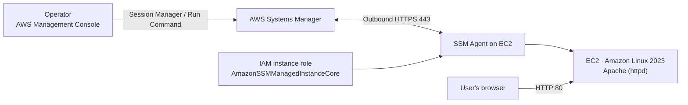

# Securely Managing EC2 Instances with AWS Systems Manager

This hands-on project demonstrates how to manage an **Amazon EC2** instance using **AWS Systems Manager (SSM)** without creating an SSH key pair or opening SSH port 22. **Session Manager** provides browser-based shell access, while **Run Command** installs and configures a web server. The website is then verified over HTTP.

> **Screenshot note:** The existing screenshots document instance creation and access, but the website screenshot displays **Nginx**, and the terminal screenshot includes Nginx-related commands. They do not prove that **Apache** is running. The instructions below use Apache as required by the scenario. To make the screenshots match the completed Apache setup, run the Run Command instructions and capture a new website screenshot after verifying it.

## Project Overview

Instead of connecting to the server over SSH and managing keys, the EC2 instance receives an **IAM instance profile** that allows the Systems Manager Agent to communicate with the service. An operator can then open a secure session from the AWS Console and send commands using Run Command. SSH remains closed, while HTTP is enabled to serve the Apache page.



## Project Contents

| File | What the screenshot shows |
|---|---|
| [`screenshot/Role-SSM.png`](screenshot/Role-SSM.png) | The IAM role and its attached permission policies |
| [`screenshot/Create-EC2-withOut-keyper.png`](screenshot/Create-EC2-withOut-keyper.png) | An EC2 instance launched without an SSH key pair |
| [`screenshot/Session-Manger.png`](screenshot/Session-Manger.png) | A terminal session through Session Manager |
| [`screenshot/SSM-Start-session.png`](screenshot/SSM-Start-session.png) | The Session Manager sessions page |
| [`screenshot/EC2-website.png`](screenshot/EC2-website.png) | The website opened using the instance address; the current screenshot shows Nginx |

## Prerequisites

- An AWS account with permission to use EC2, IAM, and Systems Manager.
- An **Amazon Linux 2023** instance in a network that allows it to reach Systems Manager.
- A security group that allows inbound HTTP traffic on port **80**.
- No SSH key pair and no inbound rule for port **22** are required.

## Implementation Steps

### 1. Create an IAM Role for the Instance

1. Open **IAM → Roles → Create role**.
2. Select **AWS service**, then choose **EC2** as the trusted entity.
3. Attach the AWS managed policy **AmazonSSMManagedInstanceCore**.
4. Name and create the role.
5. When launching the instance, select this role under **Advanced details → IAM instance profile**.

**Least privilege:** The instance generally needs `AmazonSSMManagedInstanceCore` to be managed by Systems Manager. Do not attach `AmazonSSMFullAccess` to the instance just to enable connectivity. This is a broad policy for a user or operator who needs to manage SSM resources; it is not a replacement for the instance role. The role screenshot shows both policies, so review and remove unnecessary permissions before using this setup in a real environment.

### 2. Launch an EC2 Instance Without an SSH Key Pair

1. Open **EC2 → Instances → Launch instances**.
2. Choose **Amazon Linux 2023** and an instance type suitable for your test.
3. Under **Key pair (login)**, select **Proceed without a key pair**.
4. Choose a public subnet if you want to test the website using a public IPv4 address. Ensure there is a route to the internet, or configure appropriate VPC endpoints for Systems Manager.
5. Create or select a security group with the following rule:

   | Direction | Protocol | Port | Source | Purpose |
   |---|---|---:|---|---|
   | Inbound | TCP | 80 | `0.0.0.0/0` (public testing only) | Serve the website |

   Do not add a rule for port 22. For real workloads, restrict the HTTP source or use a load balancer and HTTPS as appropriate.

6. Under **Advanced details**, attach the IAM role you created, then launch the instance.
7. Wait until the instance is **Running** and its status checks pass. It should appear as a managed node in Systems Manager; this may take a few minutes.

### 3. Connect Using Session Manager

In the AWS Console, open **Systems Manager → Session Manager → Start session**, select the instance, and start the session. Alternatively, select the instance on the EC2 page and choose **Connect → Session Manager**.

The session opens a terminal in your browser without SSH or a key pair. Ensure that the instance can make outbound HTTPS connections to Systems Manager on port **443**. A public IP address alone does not guarantee connectivity if network rules or routes block it.

### 4. Install Apache Using Run Command

1. Open **Systems Manager → Run Command → Run command**.
2. Select the **AWS-RunShellScript** document.
3. Under **Targets**, select the managed instance.
4. Add the following commands, then choose **Run**:

```bash
sudo dnf install -y httpd
sudo systemctl enable --now httpd
printf '%s\n' '<!doctype html><html lang="en"><meta charset="utf-8"><title>EC2 via SSM</title><body><h1>Apache is running successfully</h1><p>This server was configured using AWS Systems Manager.</p></body></html>' | sudo tee /var/www/html/index.html
```

5. Open the command details and wait for the execution status to become **Success**. You can review each instance's output in **Command history**.

### 5. Verify the Website

Copy the instance's **Public IPv4 address** and open it in a browser using `http://`:

```text
http://<PUBLIC-IP>
```

The **Apache is running successfully** page should appear. If it does not, check that the instance is running, the command succeeded, the `httpd` service is active, the security group allows TCP/80, and the instance has a public address and a suitable network route.

## Troubleshooting

- **The instance does not appear in Session Manager:** Verify that the correct IAM role is attached, check the SSM Agent status, and confirm outbound HTTPS access on port 443 or the required VPC endpoints.
- **Run Command does not target the instance:** Confirm that it appears as a **Managed node** and that your AWS user has permission to run the command.
- **The website does not load:** Check the command execution status, the `httpd` service, the inbound port 80 rule, the public address, and the internet route.
- **The Nginx page appears instead of Apache:** Check the `httpd` service and `/var/www/html/index.html`. Make sure another service is not still using port 80, then update the screenshot after verification.

## Security and Cleanup

- Keep port **22** closed and use Session Manager for administrative access.
- Do not grant broad administrative permissions to the instance role. Separate operator permissions from instance permissions and follow least privilege.
- Expose HTTP publicly only when needed for testing. Stop or terminate the instance when finished to avoid unexpected charges.

## Expected Outcome

Manage the EC2 instance from the AWS Console using Session Manager and Run Command, without an SSH key pair or an open port 22, and serve an Apache webpage over HTTP.