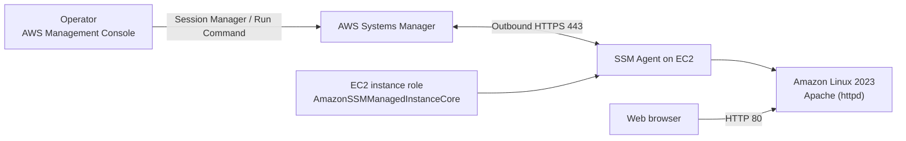
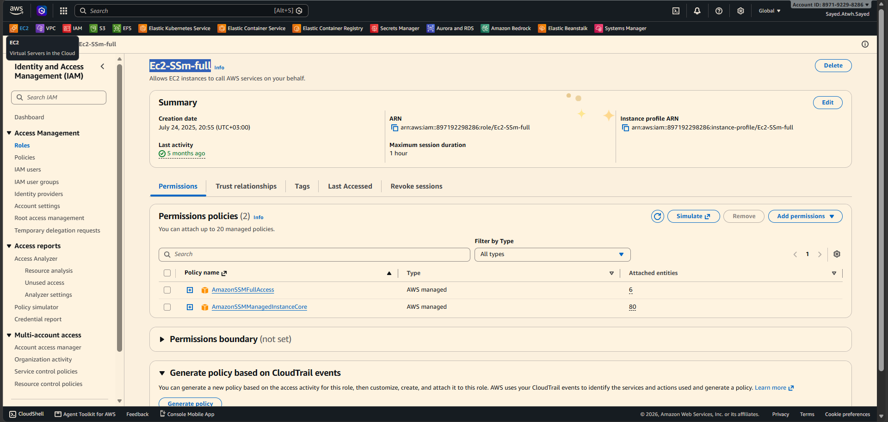
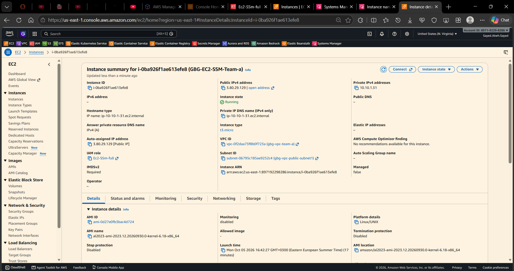
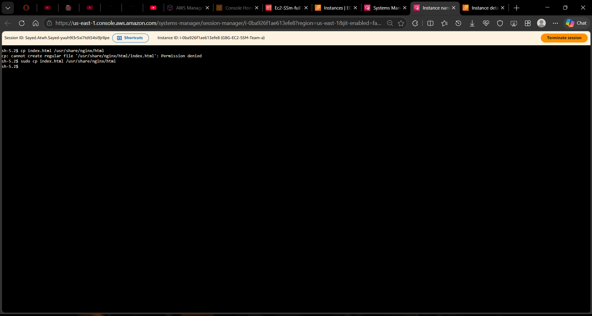
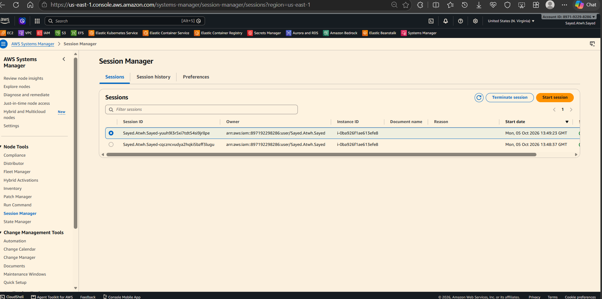
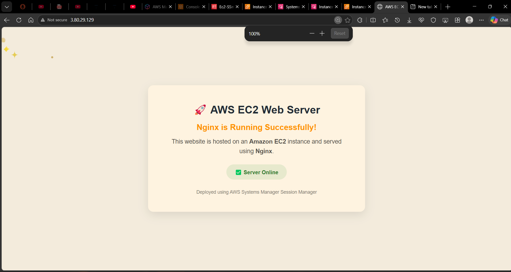

<div align="center">

# Secure EC2 Management with AWS Systems Manager

### Connect to and manage an Amazon Linux instance without SSH keys or port 22

**EC2** · **IAM** · **AWS Systems Manager** · **Session Manager** · **Run Command**

</div>

---

## Project Overview

This project demonstrates a more secure way to manage an **Amazon EC2** instance using **AWS Systems Manager (SSM)**. Instead of creating an SSH key pair and opening port **22**, an operator connects through **Session Manager** and runs administrative commands through **Run Command**.

The walkthrough launches an **Amazon Linux 2023** instance, attaches an IAM role, installs **Apache**, and verifies the web page over HTTP.

> [!IMPORTANT]
> The screenshots currently in this repository show **Nginx**, not Apache. The terminal screenshot also contains Nginx-related commands. The Apache commands below follow the project scenario, but the existing website screenshot does not verify Apache. A new screenshot should be captured after Apache has been installed and checked.

## How It Works



The instance role lets the SSM Agent register with Systems Manager. The operator then uses the AWS Console to open a browser-based shell or run commands. Port **22** stays closed; port **80** is used only to display the website.

## Walkthrough

### 1. Create the EC2 Instance Role

Create an IAM role trusted by **EC2** and attach the AWS-managed policy **AmazonSSMManagedInstanceCore**. Attach this role to the instance when you launch it.

<p align="center">
  
</p>
<p align="center"><em>IAM role configuration shown in the project screenshot.</em></p>

> [!WARNING]
> The screenshot shows both `AmazonSSMManagedInstanceCore` and `AmazonSSMFullAccess`. The instance normally needs **AmazonSSMManagedInstanceCore** for Systems Manager connectivity. Avoid attaching the broad `AmazonSSMFullAccess` policy to the instance role unless it is specifically required. Give operators only the permissions they need, separately from the instance role.

### 2. Launch an Instance Without an SSH Key Pair

In **EC2 → Launch instances**:

1. Choose **Amazon Linux 2023**.
2. Under **Key pair (login)**, choose **Proceed without a key pair**.
3. Select a subnet and attach the IAM role created above.
4. Allow inbound **TCP port 80** in the security group so the website can be tested.
5. Do **not** add an inbound rule for port **22**.

For a public-browser test, the instance needs a public IPv4 address and a route that permits internet access. Alternatively, configure the required Systems Manager VPC endpoints.

<p align="center">
  
</p>
<p align="center"><em>EC2 instance details. The key-pair selection itself is not visible in this screenshot.</em></p>

### 3. Open a Session Manager Session

In the AWS Console, open **Systems Manager → Session Manager → Start session**, select the managed instance, and start the session. You can also choose **Connect → Session Manager** from the EC2 instance page.

The instance needs outbound HTTPS access on port **443** to reach Systems Manager. A public IP address alone does not guarantee that this connection is available.

<p align="center">
  
</p>
<p align="center"><em>Session Manager session list.</em></p>

<p align="center">
  
</p>
<p align="center"><em>Browser-based shell connected to the instance. This capture shows Nginx-related commands, not the Apache setup below.</em></p>

### 4. Install Apache with Run Command

Open **Systems Manager → Run Command → Run command**, select **AWS-RunShellScript**, target the managed instance, and submit:

```bash
sudo dnf install -y httpd
sudo systemctl enable --now httpd
printf '%s\n' '<!doctype html><html lang="en"><meta charset="utf-8"><title>EC2 via SSM</title><body><h1>Apache is running successfully</h1><p>This server was configured using AWS Systems Manager.</p></body></html>' | sudo tee /var/www/html/index.html
```

Wait for the command status to show **Success**. Review the per-instance output in **Command history** if the command fails.

### 5. Verify the Website

Copy the instance's **Public IPv4 address** and open `http://<PUBLIC-IP>` in a browser. After the Apache commands above succeed, the page should display **Apache is running successfully**.

<p align="center">
  
</p>
<p align="center"><em>Existing website screenshot. It currently reports that Nginx is running, so it is not evidence of the Apache result.</em></p>

## Configuration at a Glance

| Component | Configuration |
|---|---|
| Operating system | Amazon Linux 2023 |
| Instance access | AWS Systems Manager Session Manager |
| Remote commands | Systems Manager Run Command |
| Instance permissions | `AmazonSSMManagedInstanceCore` |
| SSH key pair | Not used |
| Inbound SSH | Port 22 remains closed |
| Web access | HTTP on port 80 |
| Web server in the written procedure | Apache (`httpd`) |

## Troubleshooting

| Symptom | What to check |
|---|---|
| Instance is missing from Session Manager | Confirm the EC2 role is attached, the SSM Agent is running, and outbound HTTPS on port 443 or the required VPC endpoints are available. |
| Run Command cannot reach the instance | Confirm it appears as a **Managed node** and that the operator can run commands. |
| Website does not load | Check the Run Command result, `httpd` service status, inbound TCP/80, public IP, and network route. |
| Nginx appears instead of Apache | Check that `httpd` is running and that `/var/www/html/index.html` contains the expected page. Replace the website screenshot after verification. |

## Security and Cleanup

- Keep inbound port **22** closed and use Session Manager for administrative access.
- Follow least privilege: separate the permissions of the EC2 instance role from those of the operator.
- Expose HTTP publicly only for testing; restrict the source or use HTTPS for real workloads.
- Stop or terminate the instance when it is no longer needed to avoid ongoing charges.

## Expected Result

The EC2 instance is managed from the AWS Console using Session Manager and Run Command, with no SSH key pair and no open SSH port. Apache serves a test page over HTTP.
